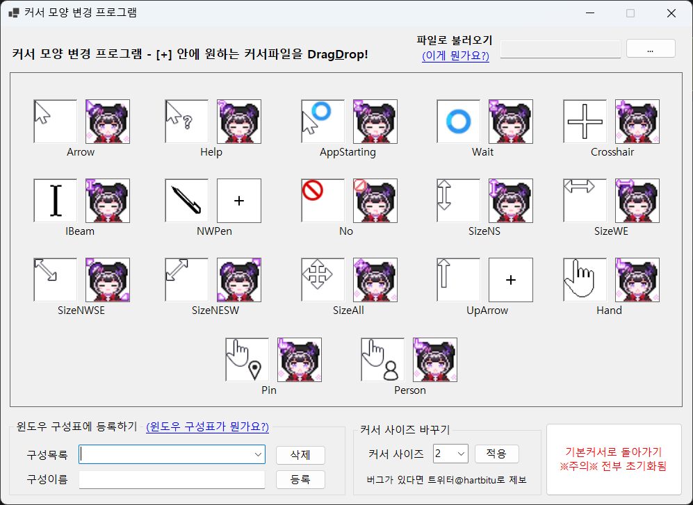

SimpleCursorChanger  
===
- C#/.NET7.0로 작성된 커서 이미지 파일 간단하게 교체하는 프로그램입니다
- Windows환경에서만 사용가능합니다

다운로드 / Download
===
https://github.com/atelierO/SimpleCursorChanger/releases

사용법 / Usage
===
####  커서 업로드&변경
1. 방법1 : Drag&Drop
    - [+]모양에 커서파일(.cur이나.ani)를 Drag&Drop하면 해당 커서 모양으로 커서 바로 변경됩니다
2. 방법2 : 불러오기를 이용하기
    - 파일로 불러오기 옆에 ...을 클릭하여 커서파일을 불러옵니다(여러개 파일 한번에 불러오기 가능)
    - 커서 파일의 이름이 Arrow,Help 등 프로그램에 적혀있는 이름과 같아야합니다

#### 커서 구성 윈도우에 등록하기
1. 작업완료 시 편의를 위해 커서의 구성을 윈도우에 등록할 수 있게 했습니다
2. 구성목록 콤보박스를 클릭하면 현재 등록된 커서 구성이 나옵니다
3. 구성이름에 현재 적용한 커서의 이름을 작성하고 등록 버튼을 클릭하면 등록완료
4. 프로그램을 껐다 켜도 언제나 구성목록에서 내가 만든 커서 구성을 불러올 수 있습니다
5. 삭제를 누르면 현재 선택한 구성을 삭제합니다(경고창 안나오니 주의하시길)

#### 커서 사이즈 바꾸기

- 커서 사이즈르 콤보박스에서 누른다음 적용만 하면 끝

#### 기본커서로 돌아가기
 - 클릭시 즉시 커서가 기본 커서로 바뀝니다
 - 작업중에 누르면 다 사라질지도...?

예시 / Example
---

불러오기를 이용할시 바꿔야할 커서 이름을 정리해봤어요

| 이미지 image |  한글명  | English Name  |  포맷 Format  |
|-----------------|----------|---------------|-----------------|
|       | 일반 선택               | Normal Select | Arrow |
|        | 도움말 선택             | Help Select  | Help |
| | 백그라운드 작업         | Working in Background | AppStarting |
|        | 사용 중                 | Busy  | Wait |
|       | 정밀도 선택             | Precision Select | Crosshair   |
|        | 텍스트 선택             | Text Select | IBeam       |
|       | 필기                    | Handwriting | NWPen       |
|          | 사용할 수 없음          | Unavailable   | No          |
|      | 수직 크기 조절          |  Vertical Resize | SizeNS      |
|     | 수평 크기 조절          | Horizontal Resize   | SizeWE      |
|   | 대각선 방향 크기 조절 1 | Diagonal Resize 1  | SizeNWSE    |
|   | 대각선 방향 크기 조절 2 | Diagonal Resize 2 | SizeNESW    |
|    | 이동                   | Move  | SizeAll     |
|    | 대체 선택              | Alternate Select  | UpArrow     |
|       | 연결 선택              | Link Select  | Hand        |
|        | 위치 선택              | Location Selet  | Pin         |
|     | 사용자 선택            | Person Select  | Person      |

위 정보를 토대로 아래와 같이 파일이름을 구성해보자

